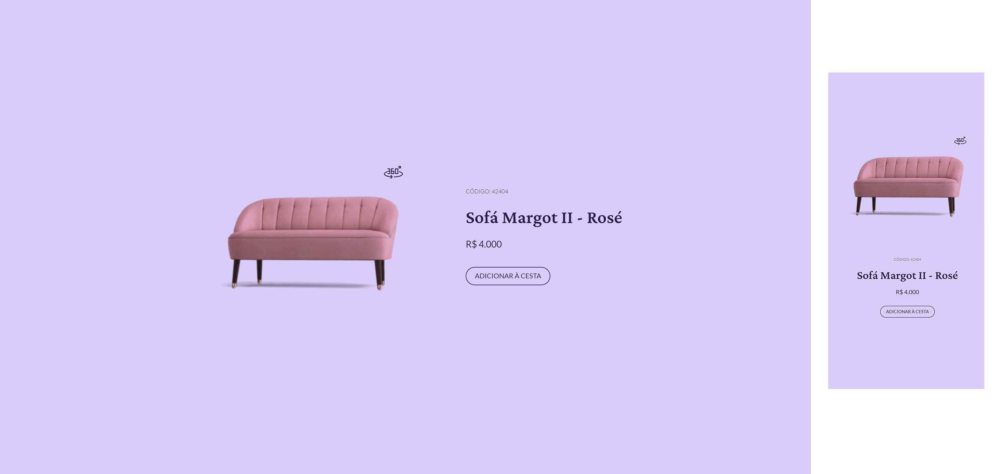

# #boraCodar - Desafio 02

> Móveis 360

## Description
This is a product page for a furniture shop, created with pure `HTML` `CSS` and `Javascript`.

[Click to view it live!](https://jessicaranft.github.io/BoraCodar-Desafio02/)

## Main features:
- Responsive page with mobile & desktop versions
- Semantic HTML
- When you click the 360 icon, it changes to a rotating version of the image
- Click the X icon to go back to the static image

## Software

VSCode
